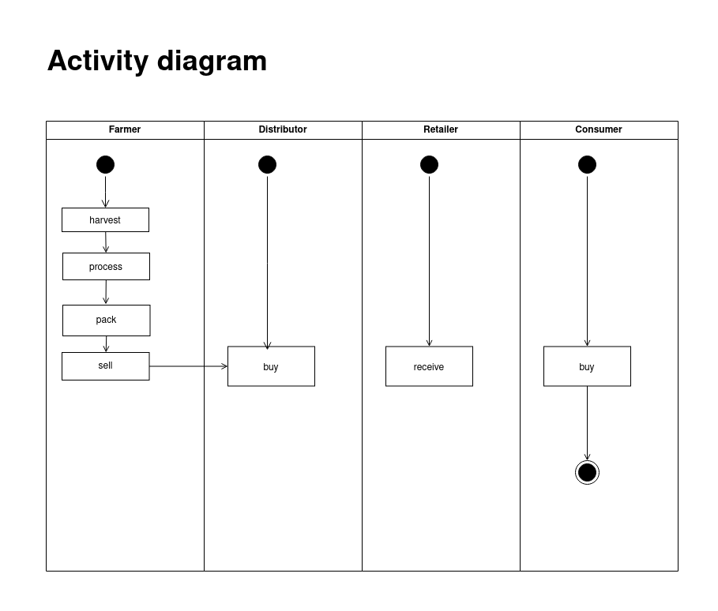
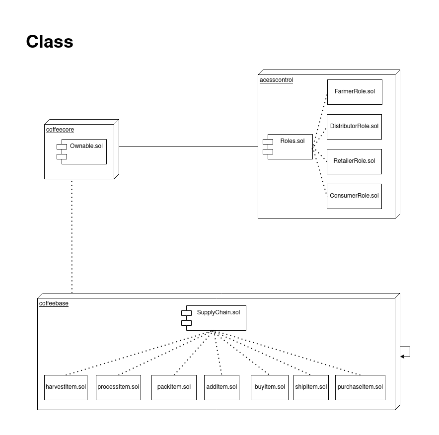

# Supply chain & data auditing

This repository containts an Ethereum DApp that demonstrates a Supply Chain flow between a Seller and Buyer. The user story is similar to any commonly used supply chain process. A Seller can add items to the inventory system stored in the blockchain. A Buyer can purchase such items from the inventory system. Additionally a Seller can mark an item as Shipped, and similarly a Buyer can mark an item as Received.

The DApp User Interface when running should look like...


# UML








## Getting Started

These instructions will get you a copy of the project up and running on your local machine for development and testing purposes. See deployment for notes on how to deploy the project on a live system.

### Prerequisites

Please make sure you've already installed ganache-cli, Truffle and enabled MetaMask extension in your browser.

```
Give examples (to be clarified)
```

### Installing

> The starter code is written for **Solidity v0.4.24**. At the time of writing, the current Truffle v5 comes with Solidity v0.5 that requires function *mutability* and *visibility* to be specified (please refer to Solidity [documentation](https://docs.soliditylang.org/en/v0.5.0/050-breaking-changes.html) for more details). To use this starter code, please run `npm i -g truffle@4.1.14` to install Truffle v4 with Solidity v0.4.24. 

A step by step series of examples that tell you have to get a development env running

Clone this repository:

```
git clone https://github.com/udacity/nd1309/tree/master/course-5/project-6
```

Change directory to ```project-6``` folder and install all requisite npm packages (as listed in ```package.json```):

```
cd project-6
npm install
```

Launch Ganache:

```
ganache-cli -m "spirit supply whale amount human item harsh scare congress discover talent hamster"
```

Your terminal should look something like this:

~/dev/udacity/coffee$ ganache-cli -m "spirit supply whale amount human item harsh scare congress discover talent hamster"
Ganache CLI v6.12.2 (ganache-core: 2.13.2)

Available Accounts
==================
(0) 0x27D8D15CbC94527cAdf5eC14B69519aE23288B95 (100 ETH)
(1) 0x018C2daBef4904ECbd7118350A0c54DbeaE3549A (100 ETH)
(2) 0xCe5144391B4aB80668965F2Cc4f2CC102380Ef0A (100 ETH)
(3) 0x460c31107DD048e34971E57DA2F99f659Add4f02 (100 ETH)
(4) 0xD37b7B8C62BE2fdDe8dAa9816483AeBDBd356088 (100 ETH)
(5) 0x27f184bdc0E7A931b507ddD689D76Dba10514BCb (100 ETH)
(6) 0xFe0df793060c49Edca5AC9C104dD8e3375349978 (100 ETH)
(7) 0xBd58a85C96cc6727859d853086fE8560BC137632 (100 ETH)
(8) 0xe07b5Ee5f738B2F87f88B99Aac9c64ff1e0c7917 (100 ETH)
(9) 0xBd3Ff2E3adEd055244d66544c9c059Fa0851Da44 (100 ETH)

Private Keys
==================
(0) 0x9137dc4de37d28802ff9e5ee3fe982f1ca2e5faa52f54a00a6023f546b23e779
(1) 0x18911376efeff48444d1323178bc9f5319686b754845e53eb1b777e08949ee9b
(2) 0xf948c5bb8b54d25b2060b5b19967f50f07dc388d6a5dada56e5904561e19f08b
(3) 0xfad19151620a352ab90e5f9c9f4282e89e1fe32e070f2c618e7bc9f6d0d236fb
(4) 0x19d1242b0a3f09e1787d7868a4ec7613ac4e85746e95e447797ce36962c7f68b
(5) 0x3bb675f8c07099816e23a3e283090cfb0f793ab625b73ca51a2d027a3c1f2d0e
(6) 0x0faf45306c7daf14d86c266690ce54490e8c0104154cafa87d9e93724efc239d
(7) 0xf2a921dee0ebd7bfaba1a271bcd48c99baa6341a1cdf84ba843521a5555e0273
(8) 0x62734594840dade92a24448c8f676cc3c59fd68909837303417295f2c0f27963
(9) 0xc29afb730456eb83415046550faf8065c8531765396156db8d97fd1fd64c6a6e

HD Wallet
==================
Mnemonic:      spirit supply whale amount human item harsh scare congress discover talent hamster
Base HD Path:  m/44'/60'/0'/0/{account_index}

Gas Price
==================
20000000000

Gas Limit
==================
6721975

Call Gas Limit
==================
9007199254740991

Listening on 127.0.0.1:8545


In a separate terminal window, Compile smart contracts:

```
truffle compile
```

Your terminal should look something like this:


This will create the smart contract artifacts in folder ```build\contracts```.

Migrate smart contracts to the locally running blockchain, ganache-cli:

```
truffle migrate
```

Your terminal should look something like this:


Test smart contracts:

```
truffle test
```

All 10 tests should pass.


In a separate terminal window, launch the DApp:

```
npm run dev
```

## Built With

* [Ethereum](https://www.ethereum.org/) - Ethereum is a decentralized platform that runs smart contracts
* [Truffle Framework](http://truffleframework.com/) - Truffle is the most popular development framework for Ethereum with a mission to make your life a whole lot easier.


## Acknowledgments

* Solidity 0.4.24
* web3 1.5.2
* Ganache-cli v6.12.2(ganache-core: 2.13.2)
* Truffle v4.1.14
* truffle-hdwallet-provider 1.0.17
